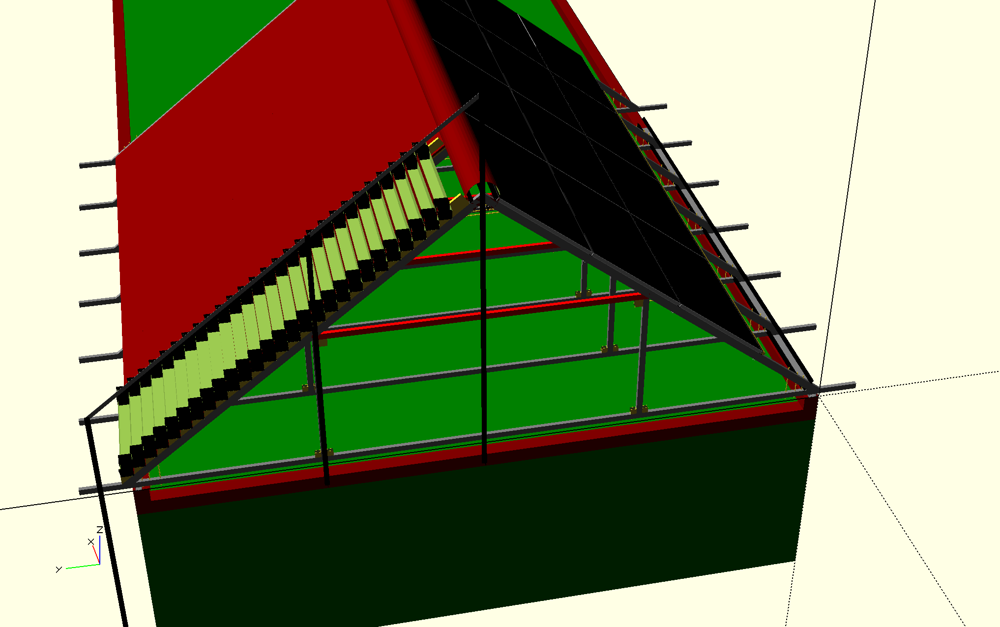

# F-Roof CAD files
A multi-function single-layer roof

## Homepage

[github.com/f-roof](https://github.com/f-roof)

## Software needed

[OpenSCAD](http://www.openscad.org)

Make sure that you have the latest development snapshot which can be downloaded from menu _Downloads_ of the webpage of the software.

## How to compile

Open [main.scad](main.scad) file with _OpenSCAD_ and press the _Preview_ button (or F5) ... and wait for several seconds (or minutes if you have a slow computer).

Then press _View all_ button (or Ctrl+Shift+V) to view the entire drawing and use the mouse to navigate.

Note that left button drag means rotate, right button drag means move and the wheel means zoom.

## Project structure

[trusses](trusses) folder contains the design for the trusses. Note that multiple versions have been designed.

[basic](basic) folder contains basic components (not specific to roofs) required to design the roof.

[house](house) folder contains house (without roof) design.

[main.scad](main.scad) is the main file of the project.

[params.scad](params.scad) contains some important parameters for the roof. Note that some values must NOT be changed. For instance, the **angle_roof** must be kept to 38 because it is computed so that 2 gutters touch eachother.

## Warning

This is work in progress.
Not all components are shown in the project.
Build it on your own risk!

## Author

Mihai Oltean

## License

MIT